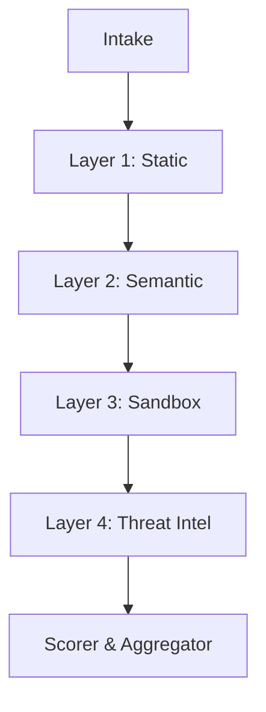

# Skill Doctor Architecture

This document describes the core dataflow and layer contracts of the `skill-doctor-core` crate.

## Pipeline Dataflow

When a skill bundle is ingested, it traverses four sequential layers. The system is designed to degrade gracefully—if an API key is missing or the sandbox is disabled, the pipeline continues with the remaining layers.

## Layer Contracts

### 1. Intake
- **Contract:** Accepts local paths, URLs, or repository shorthand. Normalizes all inputs into an in-memory or temp-extracted standard directory structure.

### 2. Layer 1: Static Analysis
- **Contract:** Fast AST parsing (via tree-sitter) and regex/rule matching (via YARA-X).
- **Output:** Exact match line numbers and confidence scores for known patterns (e.g. `eval()`, hardcoded secrets).

### 3. Layer 2: Semantic LLM
- **Contract:** Contextual review using an OpenAI-compatible REST API. Evaluates the *intent* of the skill against its stated description.
- **Output:** Natural language justifications and high-confidence behavioral flags (e.g. "Instruction attempts to hide output from user").

### 4. Layer 3: Behavioral Sandbox
- **Contract:** Executes the skill or its companion scripts in a constrained `microsandbox` environment. Intercepts syscalls and network requests.
- **Output:** Runtime traces demonstrating actual execution of malicious payloads (e.g. DNS lookups to exfiltration domains).

### 5. Layer 4: Threat Intel
- **Contract:** Hash-based lookups (SHA-256) of files against a distributed threat database.
- **Output:** Immediate critical-severity findings for exact matches of known-malicious skill signatures.
