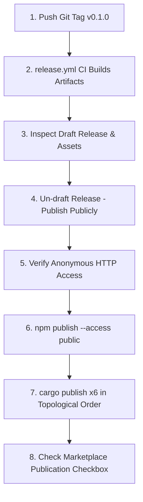

# Skill Doctor Release & Publication Playbook

This document defines the strictly ordered procedure for cutting and publishing a release of Skill Doctor (e.g. `v0.1.0`).

---

## 1. Release Order & Pipeline Overview

The release sequence is strictly linear:



### Critical Ordering Invariant: Never Publish npm While Release is in Draft

> [!CAUTION]
> **CRITICAL**: Do **NOT** run `npm publish` while the GitHub release is still in Draft state!
>
> **Why?**
> The npm package (`@kalarislabs/skill-doctor`) is a thin installer. When a user runs `npx @kalarislabs/skill-doctor` or `npm install -g @kalarislabs/skill-doctor`, the postinstall hook (`scripts/download-binary.js`) anonymously fetches `SHA256SUMS.txt` and the platform archive directly from GitHub Releases:
> `https://github.com/KalarisLabs/Skill-Doctor/releases/download/v${VERSION}/...`
>
> Assets on **Draft** releases return **HTTP 404** for unauthenticated users. If npm is published before the release is un-drafted, all user installations will immediately crash with:
> `HTTP 404: Not Found (https://github.com/KalarisLabs/Skill-Doctor/releases/download/v0.1.0/SHA256SUMS.txt)`
>
> You must **un-draft** the GitHub release and verify anonymous HTTP access **before** publishing to npm!

---

## 2. Step-by-Step Publication Procedure

### Step 1: Tag the Commit
Ensure the release commit is clean, MSRV passes, and CI is green:
```bash
git tag -s v0.1.0 -m "Release v0.1.0"
git push origin v0.1.0
```

### Step 2: Release Workflow (`release.yml`)
The workflow automatically builds the prebuilt binaries across all targets:
- `x86_64-unknown-linux-musl`
- `aarch64-unknown-linux-musl`
- `x86_64-apple-darwin`
- `aarch64-apple-darwin`
- `x86_64-pc-windows-msvc`
- `aarch64-pc-windows-msvc` (or release targets)

It then:
1. Calculates `SHA256SUMS.txt`
2. Signs `SHA256SUMS.txt` via Sigstore Cosign (OIDC keyless attestation -> `SHA256SUMS.txt.bundle`)
3. Generates the CycloneDX SBOM (`skill-doctor.cdx.json`)
4. Creates a **Draft** release containing all assets.

### Step 3: Inspect the Draft Release
Navigate to `https://github.com/KalarisLabs/Skill-Doctor/releases` and inspect the draft release:
1. Confirm all target archives (`.tar.gz` and `.zip`) are attached.
2. Confirm `SHA256SUMS.txt` and `SHA256SUMS.txt.bundle` are present.
3. Confirm `skill-doctor.cdx.json` is attached.
4. Verify checksums match local release builds.

### Step 4: Un-draft the Release
Edit the draft release on GitHub:
- Check release notes.
- Click **Publish release** (removes the `draft` flag).

### Step 5: Verify Anonymous HTTP Access
Verify using an unauthenticated curl that the checksum manifest and at least one asset can be downloaded anonymously:
```bash
# Must return HTTP 200 (or HTTP 302 redirecting to github-production-release-asset-*)
curl -sIL https://github.com/KalarisLabs/Skill-Doctor/releases/download/v0.1.0/SHA256SUMS.txt | grep -E "HTTP/.* (200|302)"
curl -sIL https://github.com/KalarisLabs/Skill-Doctor/releases/download/v0.1.0/skill-doctor-v0.1.0-x86_64-unknown-linux-musl.tar.gz | grep -E "HTTP/.* (200|302)"
```

### Step 6: Publish to npm
Ensure you are logged into npm under the `@kalarislabs` scope:
```bash
npm whoami
# Verify scoped token permissions
npm publish --access public
```

### Step 7: Publish Crates to crates.io (Strict Topological Order)
Crates must be published sequentially from leaf nodes to root so downstream crates can resolve dependencies:

```bash
# Tier 1: Leaf crates (no workspace dependencies)
cargo publish -p skill-doctor-neutralize
cargo publish -p skill-doctor-rules
cargo publish -p skill-doctor-sandbox

# Wait 30 seconds for crates.io index update
sleep 30

# Tier 2: Core analysis engine (depends on neutralize, rules)
cargo publish -p skill-doctor-core

# Wait 30 seconds for crates.io index update
sleep 30

# Tier 3: MCP server (depends on core, neutralize)
cargo publish -p skill-doctor-mcp

# Wait 30 seconds for crates.io index update
sleep 30

# Tier 4: CLI binary package (depends on all workspace crates)
cargo publish -p skill-doctor
```

### Step 8: GitHub Actions Marketplace
1. Check the **"Publish this Action to the GitHub Marketplace"** checkbox on the release page if not already checked.
2. Ensure `action.yml` is present at the repository root and points to the `v0.1.0` tag.
3. Verify `@v0.1.0` and `@v0` composite action tags resolve.
